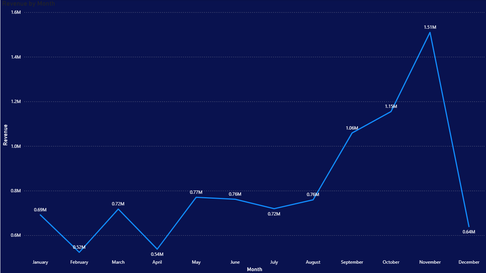
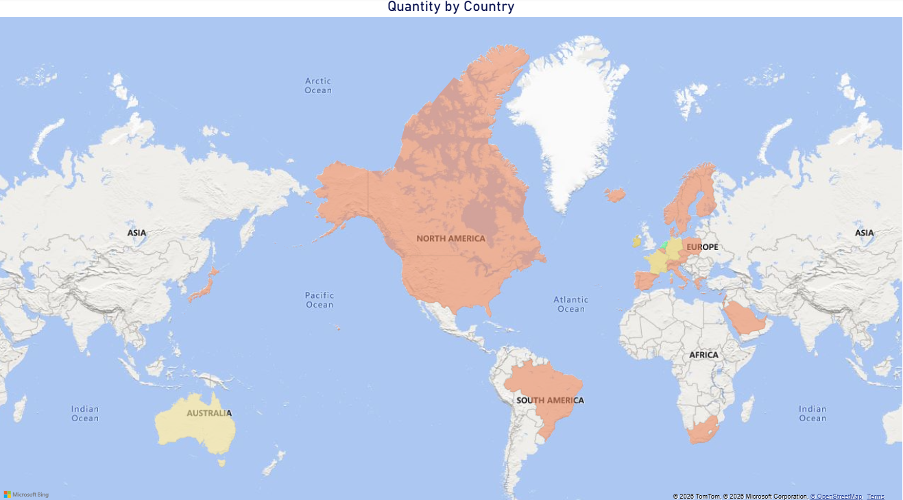
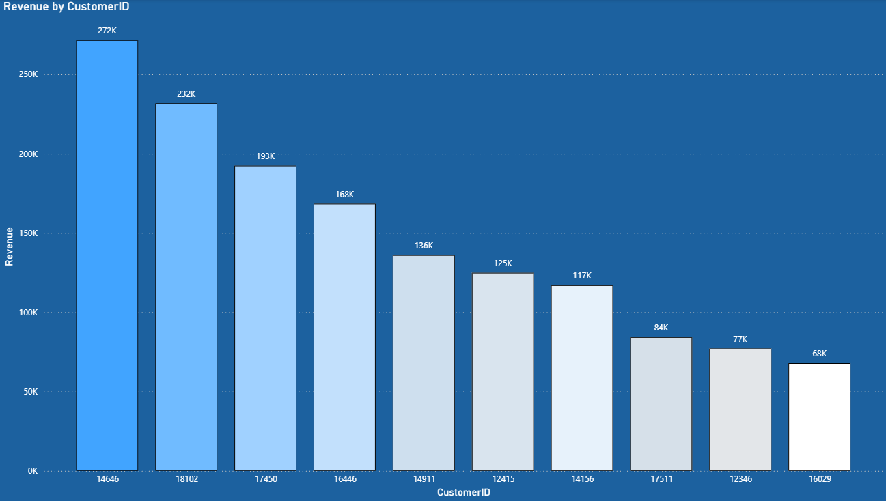
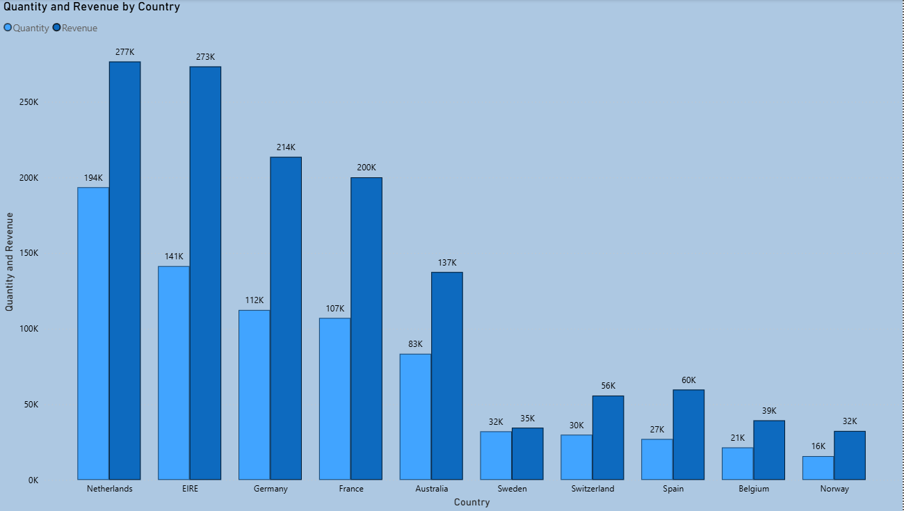

# 📊 Tata Data Visualisation Virtual Internship | Forage

## 🚀 Empowering Business Decisions Through Data Visualisation

### Virtual Job Simulation by Tata Insights & Quants (Tata iQ)

---

# 📌 Project Overview

This repository contains my completed work for the **Tata Data Visualisation: Empowering Business with Effective Insights Virtual Internship Program** offered through Forage.

During this simulation, I worked as a Data Visualization Consultant, analyzing retail business data and transforming it into meaningful insights for senior stakeholders including the CEO and CMO.

The project focused on converting raw business data into actionable recommendations through data cleaning, dashboard development, and business-focused storytelling.

---

# 🎯 Business Objectives

The primary goal was to help leadership teams understand:

✔ Revenue trends and seasonality

✔ Top-performing countries and customers

✔ Product demand across different regions

✔ Opportunities for business expansion

✔ Data-driven decision-making strategies

---

# 🛠 Skills Applied

### Data Analytics

* Data Cleaning
* Data Validation
* Data Interpretation
* Data Analysis

### Business Intelligence

* Dashboard Development
* KPI Monitoring
* Executive Reporting
* Business Storytelling

### Visualization Tools

* Microsoft Power BI
* Tableau
* Microsoft Excel

### Professional Skills

* Critical Thinking
* Effective Communication
* Information Literacy
* Stakeholder-Focused Reporting

---

# 📈 Key Deliverables

### Question 1

📊 Monthly Revenue Analysis (2011)

Analyzed revenue trends and seasonal patterns to support future forecasting and planning.

### Question 2

🌍 Top Revenue Generating Countries

Identified the highest-performing international markets excluding the United Kingdom.

### Question 3

👥 Top Revenue Generating Customers

Analyzed customer contribution to revenue and identified high-value customer segments.

### Question 4

📦 Global Product Demand Analysis

Evaluated product demand across countries to identify future expansion opportunities.

---

# 🔍 Data Preparation

To ensure reliable business insights, the dataset was cleaned before analysis.

### Validation Rules Applied

✔ Quantity ≥ 1

✔ Unit Price ≥ 0

✔ Invalid transactions excluded

✔ Revenue metrics calculated and validated

This process ensured accurate reporting and decision-making.

---

# 📊 Dashboard Snapshots

### Power BI Dashboard

### Revenue Analysis

### Customer Insights

### Regional Demand Analysis

---

# 🏆 Learning Outcomes

Through this simulation, I gained practical experience in:

* Solving real-world business problems using data
* Creating executive-level dashboards
* Presenting insights to business leaders
* Data-driven decision making
* Business Intelligence and Analytics

---

# 📜 Certification

Successfully completed the Tata Data Visualisation Virtual Internship Program offered by Forage.

---

# 👨‍💻 Author

### Virendra Solunke

Aspiring Data Analyst | SQL | Python | Excel | Power BI | Tableau | Business Intelligence

Passionate about transforming data into actionable insights through analytics, visualization, and data storytelling.

⭐ If you found this project valuable, consider giving this repository a star.
